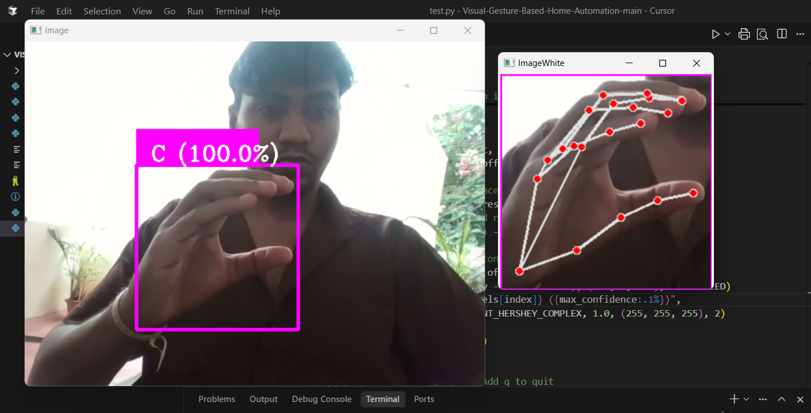
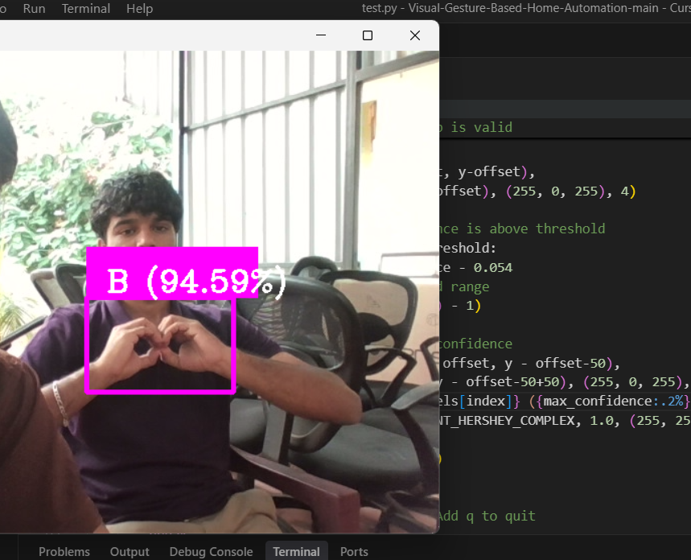
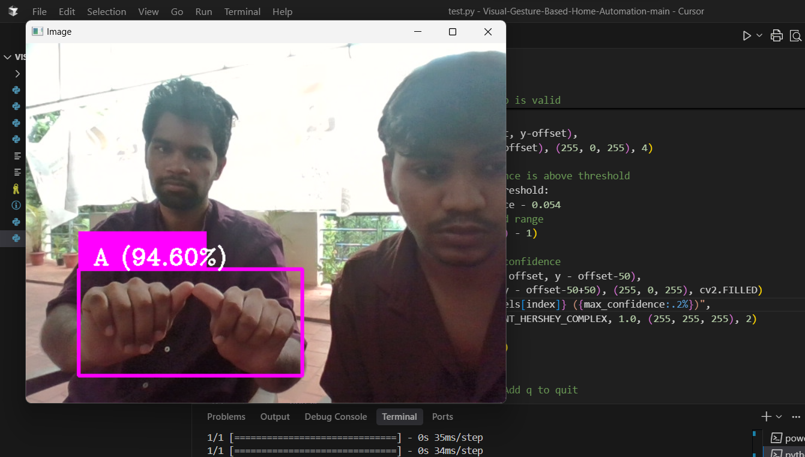

# Sign Language Recognition System

## Project Overview

This project implements a real-time **Sign Language Recognition System** using computer vision and deep learning. It enables the detection and classification of hand gestures from a live webcam feed, translating them into corresponding text labels. The system is designed with two primary components: a **data capture utility** to build custom datasets and a **real-time inference module** to predict signs based on a pre-trained model.

This project aims to provide a foundational tool for enhancing communication accessibility by bridging the gap between signed and spoken languages.

---

## Features

* **Real-time Hand Detection:** Utilizes `cvzone.HandDetector` (powered by MediaPipe) to accurately locate and track one or two hands in the webcam feed.
* **Dynamic Crooping and Preprocessing:** Automatically crops the region of interest around the detected hand(s), resizes it to a standardized input size (300x300 pixels), and places it on a white background, maintaining aspect ratio.
* **Deep Learning Classification:** Employs a pre-trained Keras model (`keras_model.h5`) to classify the processed hand images into predefined sign language labels (e.g., "A", "B", "C").
* **Confidence-Based Prediction Display:** Only displays predictions when the model's confidence exceeds a specified threshold, reducing erroneous readings.
* **Custom Data Capture:** Includes a dedicated script (`datacapture.py`) to easily collect new image data for specific signs, enabling the training or fine-tuning of custom models. This supports both single and dual-hand sign collection.
* **User-Friendly Interface:** Provides a live visual feedback loop with bounding boxes and predicted labels overlaid on the webcam stream.

---

## Getting Started

Follow these instructions to set up and run the project on your local machine.

### Prerequisites

Before you begin, ensure you have the following installed:

* **Python 3.x**
* **pip** (Python package installer)

### Installation

1.  **Clone the repository:**
    ```bash
    git clone https://github.com/Gowtham0810-hype/Sign-Language-Detection
    cd Sign-Language-Detection
    ```
  

2.  **Install dependencies:**
    ```bash
    pip install opencv-python numpy cvzone tensorflow keras
    ```
    * `opencv-python`: Core OpenCV library for image/video processing.
    * `numpy`: Essential for numerical operations, especially with image data.
    * `cvzone`: Simplifies hand detection and classifier integration.
    * `tensorflow` (or `tensorflow-cpu` if you don't have a compatible GPU): The underlying framework for Keras models.
    * `keras`: High-level neural networks API (usually included with TensorFlow).

### Model and Labels

* **`keras_model.h5`**: Place your pre-trained Keras model file in the project's root directory. This model is responsible for classifying the hand gestures.
* **`labels.txt`**: Create a `labels.txt` file in the project's root directory. This file should contain your class labels, one per line, corresponding to the output indices of your model. For example:
    ```
    0 A
    1 B
    2 C
    ```
    *(Note: Your current `labels` list in `test.py` implies that the `labels.txt` file should map index 0 to 'A', 1 to 'B', and 2 to 'C'.)*

---

## Usage

### 1. Data Capture (`datacapture.py`)

This script helps you build your own dataset for training or fine-tuning your sign language model.

1.  **Open `datacapture.py`** and modify the `folder` variable to specify the directory where you want to save images for a particular sign. For example, `folder = "data-images/YourSign"`.
2.  **Run the script:**
    ```bash
    python datacapture.py
    ```
3.  A webcam feed will open. Position your hand to perform the desired sign within the bounding box.
4.  **Press 's'** to save the current processed hand image to the specified folder. The images will be saved in a subfolder named `single` or `dual` depending on the number of hands detected.
5.  **Press 'q'** to quit the application.

**Important:** Collect a diverse set of images for each sign (different lighting, angles, slight variations in hand position) to ensure robust model training. Aim for hundreds or thousands of samples per class.

### 2. Real-time Inference (`test.py`)

This script uses your trained model to perform real-time sign language recognition.

1.  **Ensure `keras_model.h5` and `labels.txt` are in the project root.**
2.  **Open `test.py`** and adjust `confidence_threshold` if needed (default is `0.98` for very high confidence).
3.  **Run the script:**
    ```bash
    python test.py
    ```
4.  A webcam feed will open, and the system will attempt to detect hands and classify your signs in real-time.
5.  **Press 'q'** to quit the application.

---

## Screenshots

To give you a visual idea of how the Sign Language Recognition System operates, here are some screenshots from the real-time inference module (`test.py`):


**1. Detecting a Single Hand Sign (e.g., 'C')**
This image demonstrates the system accurately identifying a single hand gesture. You can see the bounding box around the hand and the predicted label with its confidence score.



**2. Detecting a Dual Hand Sign (e.g., 'A','B')**
For signs requiring two hands, the system intelligently combines the bounding boxes to enclose both hands before processing and classification.




## Project Structure
```bash
.
├── test.py                  # Real-time inference script
├── datacapture.py           # Data collection script
├── keras_model.h5           # Your pre-trained deep learning model
├── labels.txt               # Text file containing class labels
├── data-images/             # Directory to store collected image data
│   ├── A/                   # Example: Subfolder for sign 'A'
│   │   ├── single/          # Images of single hand 'A'
│   │   └── dual/            # Images of dual hand 'A' (if applicable)
│   ├── B/                   # Example: Subfolder for sign 'B'
│   └── C/                   # Example: Subfolder for sign 'C'
└── README.md                # This file
```
---

## Future Enhancements

* **Expanded Vocabulary:** Train the model on a much larger dataset of ISL signs, including more letters, numbers, and common words/phrases.
* **Continuous Sign Language Recognition:** Implement sequence models (e.g., LSTMs, Transformers) to recognize fluid, continuous sign language sentences rather than just isolated signs.
* **Improved Robustness:** Enhance performance in varied lighting conditions, backgrounds, and signer appearances.
* **User Interface:** Develop a more sophisticated graphical user interface (GUI) using frameworks like PyQt or Tkinter.
* **Mobile/Web Deployment:** Explore deploying the model to mobile devices or web platforms for broader accessibility.

---

## Contributors

* [Sarvesh R R](https://github.com/Sarvesh200416)
* [Raj K](https://github.com/Raj-2005)

---

## License

This project is open-source and available under the [MIT License](LICENSE).
